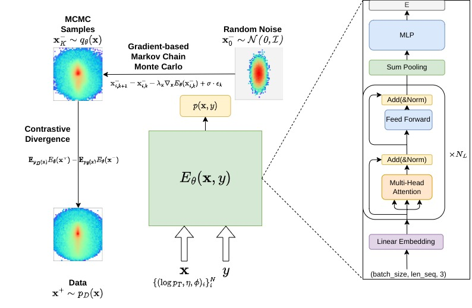

# EBM-HEP

## Energy-based probabilistic modeling of high-energy events

Code repository for ["Versatile Energy-Based Models for High Energy Physics"](https://arxiv.org/abs/2302.00695), Taoli Cheng, Aaron Courville. 

### Abstract

As a classical generative modeling approach, energy-based models have the natural advantage of flexibility in the form of the energy function. Recently, energy-based models have achieved great success in modeling high-dimensional data in computer vision and natural language processing. 
In line with these advancements, we build a multi-purpose energy-based probabilistic model for High Energy Physics events at the Large Hadron Collider.  This framework builds on a powerful generative model and describes higher-order inter-particle interactions.
It suits different encoding architectures and builds on implicit generation. As for applicational aspects, it can serve as a powerful parameterized event generator for physics simulation, a generic anomalous signal detector free from spurious correlations, and an augmented event classifier for particle identification. 

